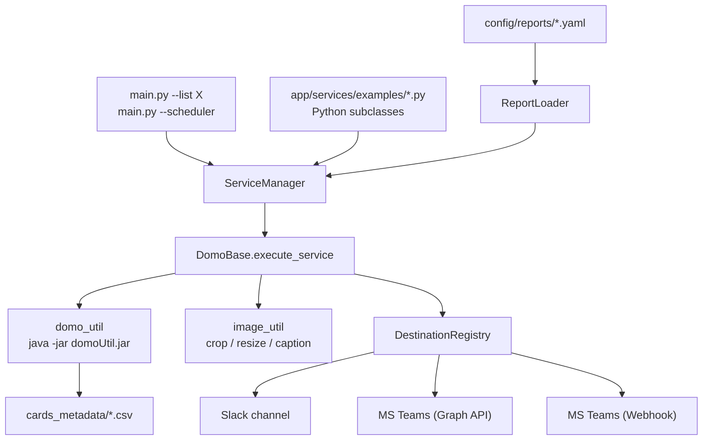

# domo-scheduled-ext-reporting

[](https://github.com/tyler-shepherd/domo-scheduled-ext-reporting/actions/workflows/ci.yaml)
[](LICENSE)
[](https://www.python.org/downloads/)

> **Send scheduled Domo card images to Slack and Microsoft Teams. YAML-driven, zero-Python required.**

A community open-source tool that takes Domo cards/dashboards and pushes them to **Slack channels** and **Microsoft Teams channels** on a cron schedule. Define your reports in a single YAML file, run one command, done.

## Features

- **Slack and Microsoft Teams** as first-class destinations -- a single report can fan out to many channels in both platforms simultaneously
- **YAML-driven config** -- add a new report by dropping a file in `config/reports/`. No Python required.
- **Python subclass escape hatch** for advanced use cases (dynamic card lists, custom logic)
- **Batched JVM** -- the original RD prototype spun up a fresh JVM per card; this one starts the JVM once per report (~5x faster on a 9-card report)
- **Built-in scheduling** via APScheduler, plus example crontab and GitHub Actions workflow
- **Smart image post-processing** -- viz-type-aware presets, per-card overrides, RGBA flattening for Teams, optional captions
- **Retry/backoff** on Domo CLI and Teams API transient failures
- **Docker-first** -- full local dev with `docker compose up -d`

## How it works



For each report run:

1. **Export metadata** -- a Domo dataset listing every card's ID/Name/URL gets exported via the bundled Domo CLI JAR
2. **Resolve cards** -- look up each `(dashboard, card)` pair in the metadata to get a card ID
3. **Batch-generate images** -- one JVM session generates every card's PNG
4. **Post-process** -- crop/resize/caption based on viz type
5. **Fan out** -- send each PNG to every destination defined for the report
6. **Cleanup** -- wipe scratch folders

## Quickstart (5 minutes, Docker)

### 1. Prerequisites

- A Domo instance + a developer access token
- A "metadata dataset" in Domo with these columns: `CardID`, `CardName`, `CardURL`, `PageID`, `PageTItle` (yes, the typo on `PageTItle` is real -- it's how Domo's CLI exports it)
- Slack: a Slack app with a Bot User OAuth Token, scopes: `channels:read groups:read chat:write files:write`
- Teams (optional): either an Azure AD app (Graph API) or per-channel Incoming Webhook URLs

### 2. Clone and configure

```bash
git clone https://github.com/tyler-shepherd/domo-scheduled-ext-reporting.git
cd domo-scheduled-ext-reporting
cp .env.example .env.local
# Edit .env.local with your real DOMO_INSTANCE / DOMO_TOKEN / etc.
```

### 3. Define a report

Edit `config/reports/example_slack_report.yaml` (or scaffold a new one):

```bash
docker compose run --rm app python main.py --scaffold --name my_first_report
# -> creates config/reports/my_first_report.yaml
```

### 4. Validate before sending

```bash
docker compose run --rm app python main.py --validate
```

### 5. Run it

```bash
# One-shot:
docker compose run --rm app python main.py --list my_first_report

# Or run the in-container scheduler (uses each report's `schedule:` field):
docker compose up -d
docker compose exec app python main.py --scheduler
```

That's it.

## YAML report reference

`config/reports/<your_report>.yaml`:

```yaml
# Required. Becomes the registry key (used in --list).
name: daily_kpis

# Required. Base file name (no extension) used when exporting the metadata
# CSV for this run. Lives in app/cards_metadata/ during the run.
metadata_dataset_file_name: daily_kpis_metadata

# Required. One or more cards.
cards:
  - dashboard: "Sales Overview"            # exact name in Domo
    card: "Daily Revenue"                  # exact name in Domo
    viz_type: "Single Value"               # see "Viz types" below
    # Optional per-card image overrides:
    crop: [0, 200, 800, 600]               # [left, upper, right, lower]
    resize: [800, 400]                     # [width, height]
    add_caption: true                      # draw card name + date below
    caption_text: "Custom caption"         # override the default

# Required. One or more destinations.
destinations:
  - type: slack
    channel_name: "daily-kpis"
    # Optional override of the env var that holds the bot token:
    # token_env: "DAILY_KPIS_SLACK_TOKEN"

  - type: teams
    auth_mode: graph                       # "graph" or "webhook"
    team_name: "Sales"                     # OR team_id
    channel_name: "Daily KPIs"             # OR channel_id

  - type: teams
    auth_mode: webhook
    webhook_url_env: "TEAMS_OPS_WEBHOOK"   # name of the env var holding the URL

# Optional. Cron expression (UTC) for `python main.py --scheduler`.
schedule: "0 14 * * *"
```

### Viz types

Built-in image presets (in [`app/utils/image_util.py`](app/utils/image_util.py)):

`Single Value`, `Multi Value`, `Line`, `Bar`, `Stacked Bar`, `Horizontal Bar`, `Pie`, `Donut`, `Heatmap`, `Map`, `Table`, `Gauge`, `Area`, `Scatter`.

Unknown viz types fall through with no edits. Per-card `crop` / `resize` always override the preset.

## Slack setup

1. Create (or pick an existing) Slack app: <https://api.slack.com/apps>
2. **OAuth & Permissions** -> add Bot Token Scopes: `channels:read`, `groups:read`, `chat:write`, `files:write`
3. Install the app to your workspace -> copy the **Bot User OAuth Token** (`xoxb-...`)
4. Set `SLACK_BOT_USER_TOKEN` in `.env.local`
5. **Invite the bot to every channel you want to post to** (`/invite @YourBotName`)
6. Reference the channel by name in your YAML: `channel_name: "daily-kpis"`

## Microsoft Teams setup

You have two choices: **Graph API** (full file uploads, recommended) or **Incoming Webhook** (simpler, no admin consent needed).

### Option A: Graph API (recommended)

1. Go to <https://entra.microsoft.com> -> **App registrations** -> **New registration**
2. Skip redirect URIs. Click Register.
3. Note the **Application (client) ID** and **Directory (tenant) ID**
4. **Certificates & secrets** -> **New client secret** -> copy the value
5. **API permissions** -> **Add a permission** -> Microsoft Graph -> Application permissions:
   - `ChannelMessage.Send`
   - `Files.ReadWrite.All`
   - `Group.Read.All`
6. Click **Grant admin consent** (requires tenant admin)
7. Set the three env vars in `.env.local`:

```
TEAMS_TENANT_ID=...
TEAMS_CLIENT_ID=...
TEAMS_CLIENT_SECRET=...
```

8. Reference your team and channel by name in YAML:

```yaml
- type: teams
  auth_mode: graph
  team_name: "Sales"
  channel_name: "Daily KPIs"
```

### Option B: Incoming Webhook

1. In your Teams channel: `...` menu -> **Connectors** -> **Incoming Webhook** -> **Configure**
2. Name and configure your webhook -> copy the URL
3. Add a **uniquely named env var** to `.env.local`:

```
TEAMS_OPS_WEBHOOK=https://outlook.office.com/webhook/...
```

4. Reference that env var in YAML:

```yaml
- type: teams
  auth_mode: webhook
  webhook_url_env: "TEAMS_OPS_WEBHOOK"
```

The image is delivered as an Adaptive Card with the PNG base64-inlined.

## Scheduling options

Pick one (or mix and match):

### Built-in APScheduler (single container)

```bash
docker compose up -d
docker compose exec app python main.py --scheduler
```

Schedules come from each report's `schedule:` field. To override globally, copy `config/schedule.yaml.example` to `config/schedule.yaml` and add entries.

### Host crontab (matches the original prototype)

Copy the example wrappers and install:

```bash
cp crontab.txt.example crontab.txt
cp cron/example-report.sh cron/my-report.sh
# edit both files
crontab crontab.txt
```

### GitHub Actions (no servers)

Rename `.github/workflows/scheduled-reports.yaml.example` to drop the `.example`, add the secrets it lists, and you're done. Free tier covers most weekly reports.

## CLI reference

```bash
python main.py --list daily_kpis weekly_summary    # run named reports
python main.py --all                                # run every report once
python main.py --scheduler                          # start in-container scheduler
python main.py --scaffold --name my_report          # create starter YAML
python main.py --validate                           # parse all YAML, no sends
```

## Project layout

```
domo-scheduled-ext-reporting/
├── app/
│   ├── configuration/        env loading, arg parser, YAML loader
│   ├── destinations/         pluggable Slack/Teams destinations
│   ├── scheduler/            APScheduler runner
│   ├── service_manager/      report registry
│   ├── services/             DomoBase + Python subclass examples
│   └── utils/                domoUtil.jar, image post-processing, logging
├── config/
│   ├── reports/              YAML report definitions
│   ├── schedule.yaml.example global schedule overrides
├── cron/                     example .sh wrappers for host crontab
├── tests/                    pytest test suite (~60 tests)
└── main.py                   CLI entrypoint
```

## Local development

```bash
# Inside the container:
make up && make shell

# Or directly on host (Python 3.10+):
python -m venv .venv && source .venv/bin/activate
pip install -r requirements.txt
pip install -e ".[dev]"

# Run tests:
pytest

# Format + lint:
black app tests main.py
ruff check app tests
```

## Troubleshooting

| Symptom | Likely cause |
|---|---|
| `Missing required configuration 'DOMO_INSTANCE'` | You didn't copy `.env.example` to `.env.local`, or `APP_ENV` doesn't match the file suffix. |
| `java not found on PATH` | The container ships a JRE, but if you're running on the host install one (`brew install openjdk` / `apt install default-jre-headless`). |
| `No metadata row matched dashboard=... card=...` | Dashboard / card name in YAML doesn't EXACTLY match the value in your Domo metadata dataset. Beware trailing spaces and pipe characters. |
| Slack: `channel_not_found` | The bot isn't invited to the channel. Run `/invite @YourBotName` in Slack. |
| Teams (Graph): `403 Forbidden` | The Azure AD app needs `ChannelMessage.Send` + `Files.ReadWrite.All` + `Group.Read.All` AND admin consent. |
| Teams (Webhook): `400 Bad Request` | Webhook URL is wrong or the channel removed the connector. |
| `Domo CLI timed out after 600s` | Your report has too many cards. Split it, or bump `_DEFAULT_TIMEOUT_SECONDS` in [`app/utils/domo_util.py`](app/utils/domo_util.py). |

## Contributing

PRs welcome. See [CONTRIBUTING.md](CONTRIBUTING.md).

## Acknowledgements

Originally prototyped as `domo-slack-reporting` for internal use at RentDynamics. This public rebuild generalizes the architecture, drops vendor lock-in, adds Microsoft Teams support, and adopts YAML-first config for the broader Domo community.

## License

[MIT](LICENSE)
