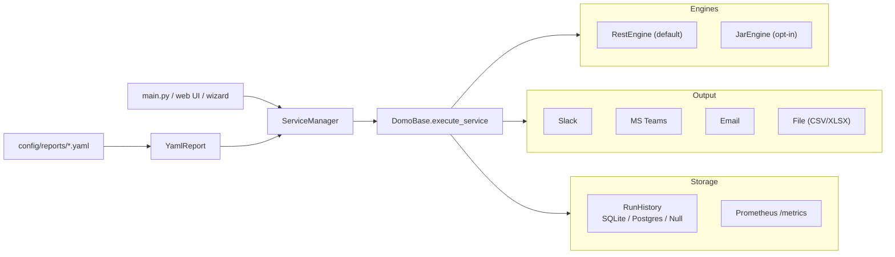

# domo-scheduled-ext-reporting

[](https://github.com/TylerShep/domo-scheduled-ext-reporting/actions/workflows/ci.yaml)
[](LICENSE)
[](https://www.python.org/downloads/)
[](#testing)

> **Send scheduled Domo card images, datasets, and rich messages to Slack, Microsoft Teams, and email. YAML-driven, zero-Python required.**

A community open-source tool that takes Domo cards/dashboards and pushes them to **Slack**, **Microsoft Teams**, and **email** on a cron schedule. Define your reports in a single YAML file, run one command, done.

v2 added a native REST client (no JVM required), persistent run history, a sandboxed alert engine, an SMTP destination, a dataset/file delivery pipeline, a `doctor` health-check CLI, and an opt-in FastAPI web UI for full-CRUD report editing. Full upgrade notes in [`docs/migration_v1_to_v2.md`](docs/migration_v1_to_v2.md).

## Features

- **Slack, Microsoft Teams, and Email** as first-class destinations -- one report fans out to many channels in any combination.
- **YAML-driven config** -- add a new report by dropping a file in `config/reports/`. No Python required.
- **Native REST engine (default), JAR fallback** -- speak to Domo over `public.domo.com` OAuth2 by default, or fall back to the bundled CLI for restricted networks. Engines are pluggable.
- **Datasets pipeline** -- export Domo datasets to CSV/XLSX and deliver to Slack, Teams, email, or a local folder via a `file` destination.
- **Sandboxed `send_when:` alerts** -- gate cards, datasets, and per-destination sends on `asteval` expressions (no `import`, no `os.system`, no dunder access).
- **Card auto-discovery** -- `cards_query:` resolves cards from page / tag filters with a TTL cache.
- **Jinja-templated copy** -- `{{ today | date }}`, `{{ value | currency }}`, `{{ delta | pct }}` work in Slack, Teams, email, and per-card captions.
- **Run history + Prometheus metrics** -- SQLite ships by default, Postgres optional, every run is recorded, `/metrics` is one extras install away.
- **Dry-run + preview modes** -- simulate a report end-to-end and write a copy of every PNG to `app/state/preview/` for eyeball review.
- **`--doctor` CLI** -- one command checks Python, env vars, engine credentials, JAR, history backend, destinations, and optional deps.
- **Web UI** (opt-in) -- FastAPI + htmx + Alpine.js, argon2 auth, full CRUD over reports, run history view, per-destination dry-run tests.
- **In-container scheduler** (APScheduler) plus example crontab and GitHub Actions workflow for serverless schedules.
- **Comprehensive test suite** -- 432 tests at 85.6% line+branch coverage; property tests, end-to-end tests, security tests, contract tests.

## How it works



Per-run lifecycle: resolve cards (explicit + auto-discovered) -> open a history record -> export the metadata dataset -> generate every card image in one engine call -> apply per-card image post-processing -> evaluate `send_when:` gates -> dispatch to each destination -> teardown buffered destinations (Email, Teams batch) -> close history. See [`docs/architecture.md`](docs/architecture.md) for the full module map.

## Quickstart (5 minutes, Docker)

```bash
git clone https://github.com/TylerShep/domo-scheduled-ext-reporting.git
cd domo-scheduled-ext-reporting
cp .env.example .env.local
# Edit .env.local with your Domo + Slack credentials.

# Sanity-check your environment.
docker compose run --rm app domo-report --doctor

# Scaffold a starter report.
docker compose run --rm app domo-report --init

# Run it.
docker compose run --rm app domo-report --list my_first_report

# Or run the in-container scheduler:
docker compose up -d
docker compose exec app domo-report --scheduler
```

The first invocation auto-downloads `domoUtil.jar` from GitHub Releases and verifies its SHA-256 -- only needed if you opt into `DOMO_ENGINE=jar`.

## YAML report reference

`config/reports/<your_report>.yaml`:

```yaml
name: daily_kpis
metadata_dataset_file_name: daily_kpis_metadata

# Either explicit cards, auto-discovery, or both. (Plus optional datasets.)
cards:
  - dashboard: "Sales Overview"
    card: "Daily Revenue"
    viz_type: "Single Value"
    crop: [0, 200, 800, 600]      # [left, upper, right, lower]
    resize: [800, 400]            # [width, height]
    add_caption: true
    caption_text: "Daily revenue as of {{ today | date('%b %-d') }}"
    send_when: "card.summary_value | float >= 10000"   # optional gate

cards_query:                       # optional auto-discovery
  page: "Sales"
  tags: ["daily"]
  exclude_tags: ["wip"]

datasets:                          # optional dataset pipeline
  - name: daily_rollup
    dataset_id: abc-123-def
    format: csv

destinations:
  - type: slack
    channel_name: "daily-kpis"
    thread: "first_card"           # optional: thread subsequent cards
    react_on_send: ["chart_with_upwards_trend"]
    comment_template: "Today's KPIs ({{ run.cards_total }} cards)"

  - type: teams
    auth_mode: graph
    team_name: "Sales"
    channel_name: "Daily KPIs"
    batch_mode: single_carousel    # one chatMessage with all attachments
    summary_template: "Daily KPIs -- {{ today | date('%A') }}"

  - type: teams
    auth_mode: webhook
    webhook_url_env: "TEAMS_OPS_WEBHOOK"
    payload_format: message_card   # sections + facts in a single post

  - type: email
    to: ["analytics@example.com"]
    subject_template: "Sales digest -- {{ today | date }}"
    body_template: |
      ## Daily KPIs
      Total revenue: {{ run.summary.total | currency }}

  - type: file
    target: local                  # or "slack" / "teams_graph" / "email"
    output_dir: "./out"
    send_when: "run.status == 'success'"  # optional gate

schedule: "0 14 * * *"             # UTC cron expression
```

Full schema reference: every key, every override, and every default lives in [`config/reports/example_*.yaml`](config/reports/).

### Viz types

Built-in image presets in [`app/utils/image_util.py`](app/utils/image_util.py):

`Single Value`, `Multi Value`, `Line`, `Bar`, `Stacked Bar`, `Horizontal Bar`, `Pie`, `Donut`, `Heatmap`, `Map`, `Table`, `Gauge`, `Area`, `Scatter`.

Unknown viz types fall through with no edits. Per-card `crop` / `resize` always override the preset.

## Engines

`DOMO_ENGINE` selects the active client (default `rest`):

| Engine  | When to pick it                                                  | Required env                                        |
| ------- | ---------------------------------------------------------------- | --------------------------------------------------- |
| `rest`  | Default. Faster cold start. No JVM. Works in slim containers.    | `DOMO_CLIENT_ID`, `DOMO_CLIENT_SECRET`              |
| `jar`   | Air-gapped or restricted networks where REST isn't reachable.    | A JRE on PATH + `domoUtil.jar` (auto-downloaded)    |

To download the JAR on demand:

```bash
domo-report --download-jar
```

The downloader hits `https://github.com/TylerShep/domo-scheduled-ext-reporting/releases/latest/download/domoUtil.jar`, verifies the SHA-256 against [`app/engines/JAR_VERSION.json`](app/engines/JAR_VERSION.json), and installs to `app/utils/domoUtil.jar`. Override the URL with `DOMO_JAR_URL`.

## Slack setup

1. Create (or pick an existing) Slack app: <https://api.slack.com/apps>
2. **OAuth & Permissions** -> add Bot Token Scopes: `channels:read`, `groups:read`, `chat:write`, `files:write`, optionally `reactions:write` for `react_on_send:`.
3. Install the app to your workspace -> copy the **Bot User OAuth Token** (`xoxb-...`).
4. Set `SLACK_BOT_USER_TOKEN` in `.env.local`.
5. **Invite the bot to every channel you want to post to** (`/invite @YourBotName`).
6. Reference the channel by name in your YAML: `channel_name: "daily-kpis"`.

Threading + reactions + scheduled sends are documented inline in [`config/reports/example_slack_report.yaml`](config/reports/example_slack_report.yaml).

## Microsoft Teams setup

Two modes: **Graph API** (full file uploads, recommended) or **Incoming Webhook** (simpler, no admin consent needed).

### Option A: Graph API (recommended)

1. Go to <https://entra.microsoft.com> -> **App registrations** -> **New registration**.
2. Skip redirect URIs. Click Register.
3. Note the **Application (client) ID** and **Directory (tenant) ID**.
4. **Certificates & secrets** -> **New client secret** -> copy the value.
5. **API permissions** -> **Add a permission** -> Microsoft Graph -> Application permissions:
   - `ChannelMessage.Send`
   - `Files.ReadWrite.All`
   - `Group.Read.All`
6. Click **Grant admin consent**.
7. Set the three env vars in `.env.local`:

   ```
   TEAMS_TENANT_ID=...
   TEAMS_CLIENT_ID=...
   TEAMS_CLIENT_SECRET=...
   ```

8. Reference your team and channel by name in YAML, optionally enabling carousel mode:

   ```yaml
   - type: teams
     auth_mode: graph
     team_name: "Sales"
     channel_name: "Daily KPIs"
     batch_mode: single_carousel
     summary_template: "Daily KPIs -- {{ today | date('%A') }}"
     mention_aad_users: ["alice@example.com"]
   ```

### Option B: Incoming Webhook

1. In your Teams channel: `...` menu -> **Connectors** -> **Incoming Webhook** -> **Configure**.
2. Name and configure your webhook -> copy the URL.
3. Add a **uniquely named env var** to `.env.local`:

   ```
   TEAMS_OPS_WEBHOOK=https://outlook.office.com/webhook/...
   ```

4. Reference that env var in YAML:

   ```yaml
   - type: teams
     auth_mode: webhook
     webhook_url_env: "TEAMS_OPS_WEBHOOK"
     payload_format: message_card        # one post with sections per card
   ```

## Email setup

```yaml
- type: email
  to: ["analytics@example.com"]
  cc: ["leadership@example.com"]
  subject_template: "Sales digest -- {{ today | date }}"
  body_template: |
    ## Daily KPIs
    Total revenue: {{ run.summary.total | currency }}
    Pipeline: {{ run.summary.pipeline | currency }}
```

```bash
SMTP_HOST=smtp.example.com
SMTP_PORT=587
SMTP_USERNAME=...
SMTP_PASSWORD=...
SMTP_FROM=reporting@example.com
```

Cards are buffered for the run and sent as a single multipart email with each PNG inlined via Content-IDs. Datasets are attached. The body is rendered as Markdown -> HTML.

## Dataset (file) destination

Drop CSV/XLSX into a folder, Slack, Teams, or email:

```yaml
datasets:
  - name: daily_rollup
    dataset_id: abc-123
    format: csv

destinations:
  - type: file
    target: local           # local | slack | teams_graph | email
    output_dir: "./out"
    send_when: "run.status == 'success'"
```

`target: slack` re-uses the same `channel_name` / `token_env` mechanics as the regular Slack destination; `target: teams_graph` uses the same Graph credentials.

## Conditional sending (`send_when:`)

`send_when:` accepts any expression that `asteval` can evaluate against a curated context (`card`, `dataset`, `run`, `env`):

```yaml
cards:
  - dashboard: Sales
    card: Daily Revenue
    viz_type: Single Value
    send_when: "card.summary_value | float > 10000"

destinations:
  - type: slack
    channel_name: "daily-alerts"
    send_when: "env.is_business_day and card.page_name == 'Sales'"
```

The sandbox runs in `asteval(minimal=True)` mode -- no `import`, no list comprehensions, no dunder access, no file IO. Any expression that fails to parse or raises is logged and **defaults to `True`** so a typo never silently drops a critical alert.

## Templating

Powered by Jinja2 with `StrictUndefined` so typos are loud. Custom filters available everywhere:

| Filter         | Example                            | Output         |
| -------------- | ---------------------------------- | -------------- |
| `currency`     | `{{ 12345.6 \| currency }}`         | `$12,345.60`   |
| `pct`          | `{{ 0.123 \| pct }}`                | `12.3%`        |
| `delta`        | `{{ 0.05 \| delta }}`               | `+5.0%`        |
| `human_number` | `{{ 3500000 \| human_number }}`     | `3.5M`         |
| `date`         | `{{ today \| date('%b %-d') }}`     | `Apr 21`       |

Available context: `today`, `now`, `run` (status, totals, summary), `card` / `dataset` (per-item), `env` (`env.is_business_day`, `env.weekday`, custom `env.*` from your YAML).

## CLI reference

```bash
domo-report --doctor                          # health-check the environment
domo-report --init                             # interactive report wizard
domo-report --list daily_kpis weekly_summary   # run named reports
domo-report --all                              # run every report once
domo-report --scheduler                        # APScheduler in-container
domo-report --validate                         # parse all YAML, no sends
domo-report --dry-run --list daily_kpis        # simulate; no sends
domo-report --preview --list daily_kpis        # also save PNGs to app/state/preview/
domo-report --serve                            # FastAPI web UI on :8080
domo-report --download-jar                     # install/verify domoUtil.jar
domo-report --list-engines                     # show registered engines
domo-report --list-destinations                # show registered destinations
```

## Web UI

```bash
pip install -e ".[web]"
export DOMO_WEB_ADMIN_USER=admin
export DOMO_WEB_ADMIN_PASSWORD_HASH=$(python -c "from app.web.auth import hash_password; print(hash_password('changeme'))")
domo-report --serve --bind-host 127.0.0.1 --bind-port 8080
```

Browse to <http://127.0.0.1:8080>. You get a server-rendered UI with:

- Full CRUD over `config/reports/*.yaml` (round-trip-edited via `ruamel.yaml`, comments preserved).
- A **Runs** view backed by your history backend.
- A **Test destination** endpoint that runs `prepare()` in dry-run mode for any spec you paste in.
- `/healthz` and `/metrics` (when the `[metrics]` extra is installed).

The whole UI is one FastAPI app, htmx for partial updates, Alpine.js for tiny in-page interactions -- no SPA, no build step.

## History + observability

```bash
RUN_HISTORY_BACKEND=sqlite     # default; writes to app/state/run_history.db
RUN_HISTORY_BACKEND=postgres   # set DATABASE_URL=postgresql://...
RUN_HISTORY_BACKEND=null       # disable
```

Every run records `RunStatus`, per-card outcomes (`sent`, `failed`, `skipped`, `skip_reason`), and per-destination outcomes (`cards_attempted`, `cards_sent`, `cards_skipped`, `error`). SQLite migrations are idempotent (`ALTER TABLE ... ADD COLUMN IF NOT EXISTS`), so existing DBs upgrade in-place.

Install the metrics extra to expose Prometheus counters at `/metrics`:

```bash
pip install -e ".[metrics]"
```

## Scheduling options

Pick one (or mix and match):

### Built-in APScheduler (single container)

```bash
docker compose up -d
docker compose exec app domo-report --scheduler
```

Schedules come from each report's `schedule:` field. Override globally via `config/schedule.yaml` (copy from `config/schedule.yaml.example`).

### Host crontab

```bash
cp crontab.txt.example crontab.txt
cp cron/example-report.sh cron/my-report.sh
# edit both files
crontab crontab.txt
```

### GitHub Actions

Rename `.github/workflows/scheduled-reports.yaml.example` to drop `.example`, add the secrets it lists, and you're done.

## Project layout

```
domo-scheduled-ext-reporting/
├── app/
│   ├── alerts/               sandboxed send_when: evaluator
│   ├── cli/                  doctor, init wizard, list commands
│   ├── configuration/        env loading, arg parser, YAML loader
│   ├── destinations/         pluggable Slack / Teams / Email / File
│   ├── engines/              REST + JAR clients + downloader
│   ├── history/              SQLite / Postgres / Null backends
│   ├── observability/        Prometheus metrics + exporter
│   ├── runtime.py            dry-run / preview flags
│   ├── scheduler/            APScheduler runner
│   ├── service_manager/      report registry
│   ├── services/             DomoBase + Python subclass examples
│   ├── templating/           Jinja2 environment + filters
│   ├── utils/                image post-processing, logging, setup
│   └── web/                  FastAPI + htmx + Alpine.js UI
├── config/
│   ├── reports/              YAML report definitions
│   └── schedule.yaml.example global schedule overrides
├── docs/
│   ├── architecture.md       module map + lifecycle diagrams
│   └── migration_v1_to_v2.md upgrade checklist
├── tests/                    432 tests across unit / e2e / property / web
├── CHANGELOG.md
├── Dockerfile
├── docker-compose.yaml
├── pyproject.toml
└── main.py                   CLI entrypoint
```

## Local development

```bash
# Inside the container:
make up && make shell

# Or directly on host (Python 3.10+):
python -m venv .venv && source .venv/bin/activate
pip install -r requirements.txt
pip install -e ".[dev,web,metrics]"

# Run the suite (with coverage gate):
pytest

# Format + lint:
black app tests main.py
ruff check app tests
```

## Testing

```bash
pytest                                 # full suite, 85% coverage gate
pytest --cov=app --cov-report=html     # html report at htmlcov/index.html
pytest tests/e2e -q                    # only end-to-end pipeline tests
pytest tests/web -q                    # only web UI tests
pytest -k send_when                    # only conditional-sending tests
```

432 tests, 85.6% line+branch coverage. Property tests via `hypothesis`, HTTP mocks via `responses`, deterministic clocks via `freezegun`.

## Troubleshooting

| Symptom | Likely cause |
| --- | --- |
| `Missing required configuration 'DOMO_INSTANCE'` | You didn't copy `.env.example` to `.env.local`, or `APP_ENV` doesn't match the file suffix. |
| `Domo CLI JAR not found` | Run `domo-report --download-jar`, or set `DOMO_ENGINE=rest` to skip the JAR entirely. |
| `java not found on PATH` | Only needed for `DOMO_ENGINE=jar`. Install a JRE (`brew install openjdk` / `apt install default-jre-headless`) or switch to REST. |
| `No metadata row matched dashboard=... card=...` | Dashboard / card name in YAML doesn't EXACTLY match the value in your Domo metadata dataset. Beware trailing spaces and pipe characters. |
| Slack: `channel_not_found` | The bot isn't invited to the channel. Run `/invite @YourBotName` in Slack. |
| Teams (Graph): `403 Forbidden` | The Azure AD app needs `ChannelMessage.Send` + `Files.ReadWrite.All` + `Group.Read.All` AND admin consent. |
| Teams (Webhook): `400 Bad Request` | Webhook URL is wrong or the channel removed the connector. |
| `send_when` expression silently passes | Check the logs -- malformed expressions log a warning and default to `True` so they never drop critical sends. |
| `domo-report --doctor` reports a missing dep | Re-install with the matching extras (`pip install -e ".[web,metrics]"`). |

## Contributing

PRs welcome. See [CONTRIBUTING.md](CONTRIBUTING.md). Open issues for bugs / feature requests on [GitHub](https://github.com/TylerShep/domo-scheduled-ext-reporting/issues).

## Acknowledgements

Originally prototyped as `domo-slack-reporting` for internal use at RentDynamics. v1 generalized the architecture, dropped vendor lock-in, added Microsoft Teams support, and adopted YAML-first config. v2 added a native REST client, persistent run history, an SMTP destination, a sandboxed alert engine, an opt-in web UI, and a full test overhaul.

## License

[MIT](LICENSE)
