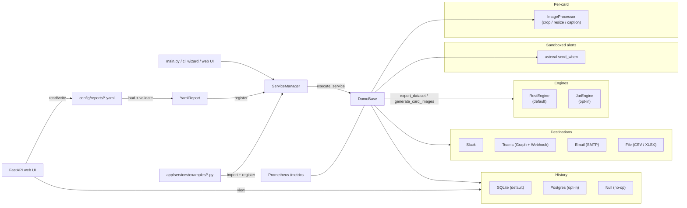
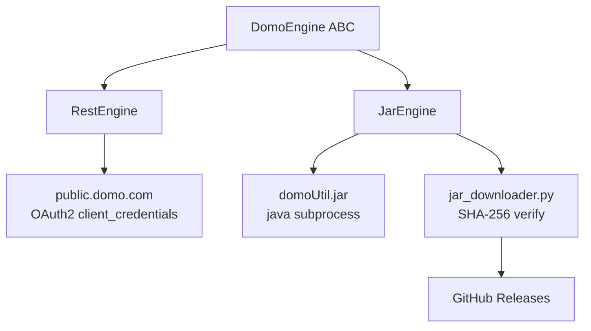

# Architecture

A bird's-eye view of how the pieces fit together as of v2.0.

## Pipeline

## Module map

| Module                          | Responsibility                                                            |
| ------------------------------- | ------------------------------------------------------------------------- |
| `app/configuration/`            | Env loading, CLI arg parser, YAML report loader + validator               |
| `app/configuration/card_resolver.py` | `cards_query:` auto-discovery + TTL cache (`app/state/discovery_cache.json`) |
| `app/engines/`                  | `DomoEngine` ABC, `RestEngine` (default), `JarEngine` (opt-in)            |
| `app/engines/jar_downloader.py` | Verifies + downloads `domoUtil.jar` from GitHub Releases on demand        |
| `app/destinations/`             | `Destination` ABC + Slack, Teams (Graph & Webhook), Email, File           |
| `app/services/base.py`          | `DomoBase.execute_service` -- orchestrates the per-report pipeline        |
| `app/service_manager/`          | Report registry + lookup                                                  |
| `app/templating/`               | Jinja2 environment with `currency`, `pct`, `delta`, `human_number` filters |
| `app/alerts/`                   | Sandboxed `asteval` evaluator powering `send_when:`                       |
| `app/history/`                  | `HistoryBackend` ABC + SQLite (default), Postgres, Null                   |
| `app/observability/`            | Prometheus metrics + (optional) standalone HTTP exporter                  |
| `app/runtime.py`                | Process-wide flags (`dry_run`, `preview`)                                 |
| `app/cli/`                      | `doctor`, `init` wizard, `--list-engines`, `--list-destinations`          |
| `app/web/`                      | FastAPI + htmx + Alpine.js full-CRUD web UI                               |
| `app/scheduler/`                | APScheduler in-container runner                                           |
| `app/utils/`                    | Image post-processing, logging, project setup helpers                     |

## Execution lifecycle

For one report invocation:

1. **Resolve.** `YamlReport.list_of_cards()` merges explicit `cards:` with anything `cards_query:` auto-discovers via `engine.list_cards()` (cached for `DISCOVERY_CACHE_TTL_SECONDS`).
2. **Pre-flight.** `DomoBase.execute_service` opens a `history.record()` context, increments the per-report Prometheus counter, and instantiates each destination from the YAML.
3. **Export metadata.** `engine.export_dataset(...)` pulls the metadata CSV used to translate `(dashboard, card)` pairs into card IDs.
4. **Generate images.** `engine.generate_card_images(requests)` produces all PNGs in one call.
5. **Per-card dispatch.** `_dispatch` runs:
   - Card-level `send_when:` gate -- skip the card if false (recorded as `skipped` in history).
   - For each destination: destination-level `send_when:` gate; on pass, call `destination.send_image(ctx)`.
   - Each `send_image` failure is captured per-destination, never aborts the whole run.
6. **Per-dataset dispatch.** `_dispatch_datasets` runs the equivalent for `datasets:` against `file` destinations.
7. **Teardown.** Every destination's `teardown()` runs (used by Email + Teams to send the buffered message). History gets the final `RunStatus`.

## Engines

`DOMO_ENGINE=rest` (default) exercises `RestEngine`, which speaks to `public.domo.com` over OAuth2 client-credentials -- no JVM, no native binary. `DOMO_ENGINE=jar` falls back to the legacy CLI for environments where the REST API isn't an option.

## History + observability

Every run produces a `RunRecord` with per-card and per-destination outcomes (including `skipped` / `cards_skipped` for `send_when` gating). The default backend is SQLite at `app/state/run_history.db`; flipping `RUN_HISTORY_BACKEND=postgres` and pointing `DATABASE_URL` at a Postgres instance migrates seamlessly (the schema adapter creates tables and applies idempotent `ADD COLUMN IF NOT EXISTS` migrations on boot).

`app/observability/metrics.py` exposes counters (runs, cards, sends, skips, failures) via `prometheus_client` when the `[metrics]` extra is installed; otherwise it degrades to no-ops so the core pipeline doesn't pay the cost.

## Web UI

`app/web/` is an opt-in FastAPI app gated behind argon2 auth + signed session cookies + CSRF tokens. It uses `ruamel.yaml` to round-trip-edit reports without losing comments or formatting. Templates are server-rendered Jinja2 with a tiny dose of htmx + Alpine.js -- no SPA, no build step.
